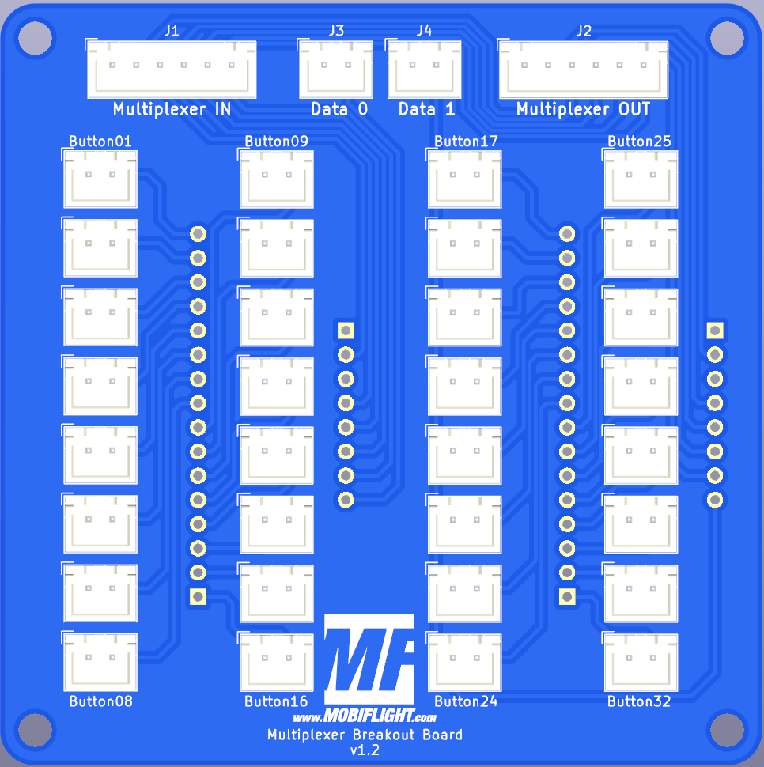
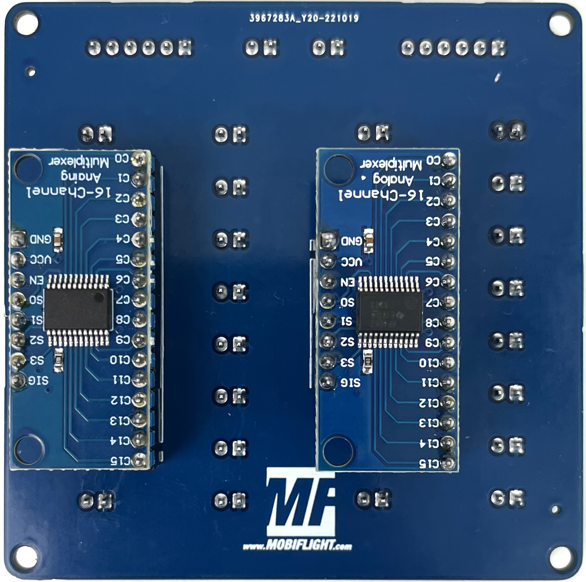
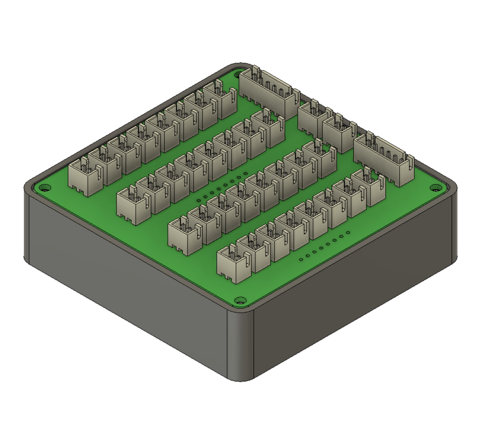
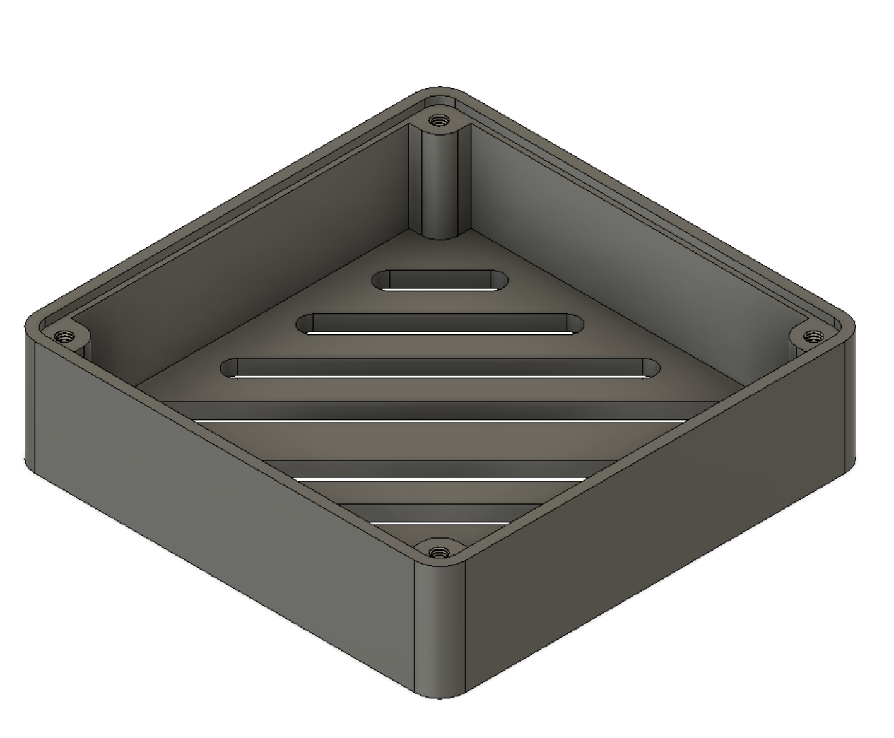
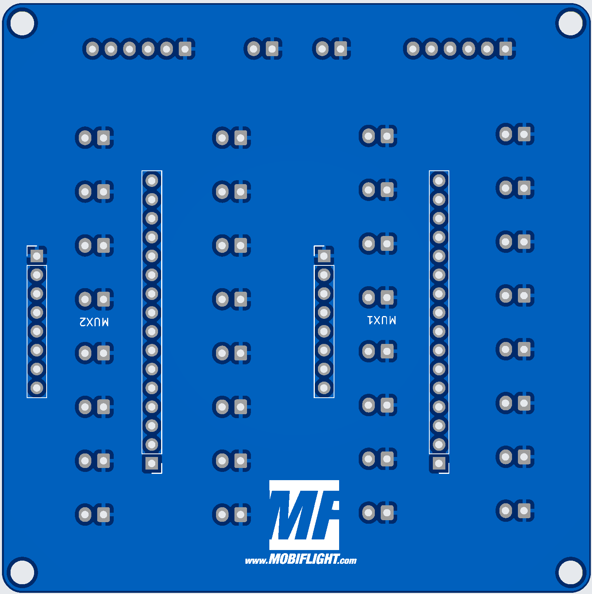
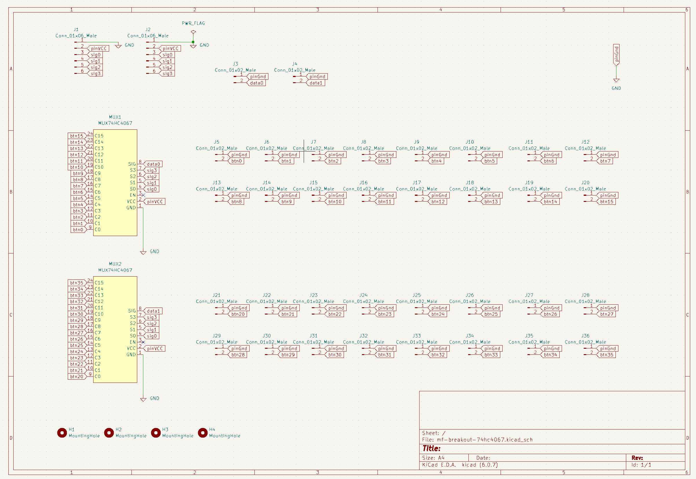

# MobiFlight Multiplexer Breakout Board
The MobiFlight Multiplexer Breakout Board is a breakout board for easier use of the 74HC4067 multiplexer. It is designed to work best together with the [MobiFlight Prototyping Board](https://shop.mobiflight.com/product/prototyping-board-v2).

On the top side, The board uses XH JST connectors for the individual inputs. On the back, you can add up to two 74HC4067 modules (https://shop.mobiflight.com/product/multiplexer).

On the bottom side, you plug in the 74HC4067 modules. Version 1.2 now shows information about the orientation and all important pins are labeled.
You can daisy chain the boards.

For more information on how to configure the board with MobiFlight, check out the [MobiFlight Connector documentation](https://github.com/MobiFlight/MobiFlight-Connector/wiki/Input-and-Output-devices#input-multiplexer).

## Board overview

### Multiplexer IN
Connection coming from your Mobiflight board, or another MobiFlight Multiplexer Breakout Board as daisy chain.

* Pin1 - GND
* Pin2 - VCC
* Pin3 - Channel 1
* Pin4 - Channel 2
* Pin5 - Channel 3
* Pin6 - Channel 4

### Data 0
Connection coming from your Mobiflight board.

* Pin1 - GND
* Pin2 - Signal pin (for the first 74HC4067)

### Data 1
Connection coming from your Mobiflight board.

* Pin1 - GND
* Pin2 - Signal pin (for the second 74HC4067)

### Multiplexer OUT
Connection to daisy chain another MobiFlight Multiplexer Breakout Board.

* Pin1 - GND
* Pin2 - VCC
* Pin3 - Channel 1
* Pin4 - Channel 2
* Pin5 - Channel 3
* Pin6 - Channel 4

### Button01-08
First row of connectors for input devices buttons and switches:

* Pin1 - Connection TO switch
* Pin2 - Connection FROM switch

Polarity doesn't matter for switches.

### Button09-16
Second row of connectors for input devices buttons and switches:

* Pin1 - Connection TO switch
* Pin2 - Connection FROM switch

Polarity doesn't matter for switches.

### Button 17-24
First row of connectors for input devices buttons and switches:

* Pin1 - Connection TO switch
* Pin2 - Connection FROM switch

Polarity doesn't matter for switches.

### Button 25-32
Second row of connectors for input devices buttons and switches:

* Pin1 - Connection TO switch
* Pin2 - Connection FROM switch

Polarity doesn't matter for switches.

## Mounting of 74HC4067 modules

As one can see on the picture, the 74HC4067 are mounted with the silkscreen facing up. Due to the asymmetric connectors, the orientation cannot be confused.

## Connecting and wiring
The multiplexer prototyping board is designed to work best together with the [MobiFlight Prototyping Board](https://shop.mobiflight.com/product/prototyping-board-v2). Of course, you can also connect it directly to any of the supported microcontrollers.

### MobiFlight Prototyping Board
The prototyping board comes with the required cables to make connection super easy.

* **Connect the 6-pin wire** from the breakout board to the MobiFlight Prototyping Board's 6-pin connector labeled **Stepper 2 / Multiplexer**
* **Connect the 2-pin wires** to the MobiFlight Prototyping Board's 2-pin connectors **Btn1** and **Btn2** respectively
* **Upload multiplexer board configuration** to the MobiFlight Prototyping Board - [Download multiplexer-config (mfmc)](https://raw.githubusercontent.com/MobiFlight/mobiflight-pcbs/refs/heads/main/prototyping-board/prototyping-board.multiplexer.mfmc)

All pins on the multiplexer will now work correctly!

### Direct connection
If you are using any of the supported microcontrollers, do the following:

#### Wiring
* Connect the first two pins on the **Multiplexer In** connector to **GND**, **5V** and the four remaining pins to free output-capable pins. For an Arduino Mega that could be, eg. D2, D3 D4 and D5. 
* Connect two input-capable pins to Data0 and Data1 connectors - first pin is **GND** and is not necessarily required, second pin is data pins. You can verify by looking on the backside of the circuit board where the pins are labeled. 

#### Board configuration
You should first add one multiplexer device with the four data pins configured as follows, and select also the pin connected to Data0. Data1 will be assigned to a another Multiplexer device we add after this one.

For the second multiplexer add another multiplexer device from the menu, the four selector pins will be the same, and the **data pin** will a unique one for the second multiplexer, D7 for example.

Click "Upload config" and your device should work.

## MobiFlight Configuration

> This information will be added soon.

## Case
You can print a case for the board [using this STL file](breakout-multiplexer-case.stl) for better handling and look:

## Additional information

### Bottom side

### Schematic

