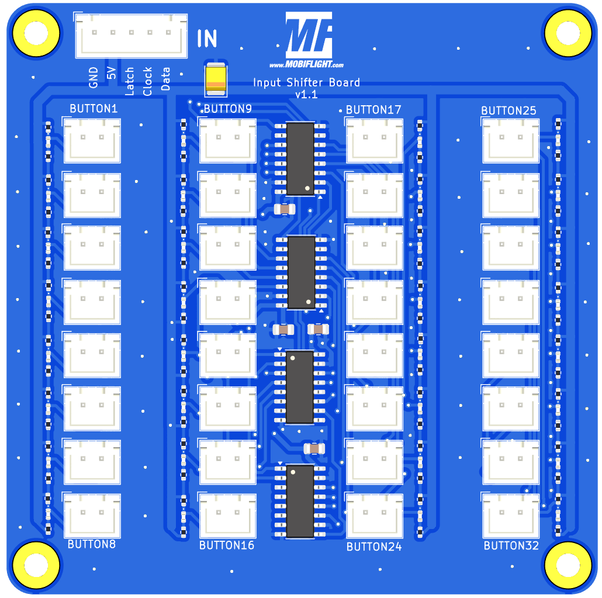
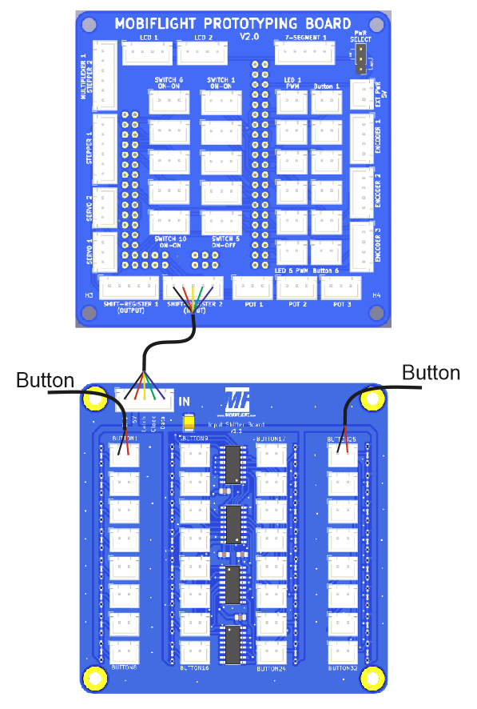
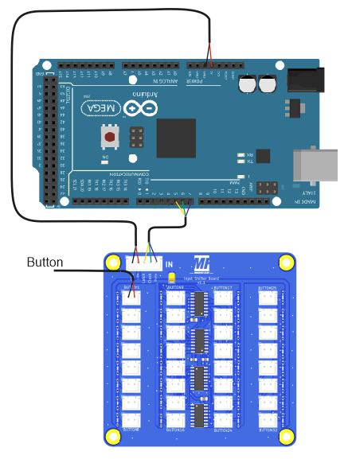
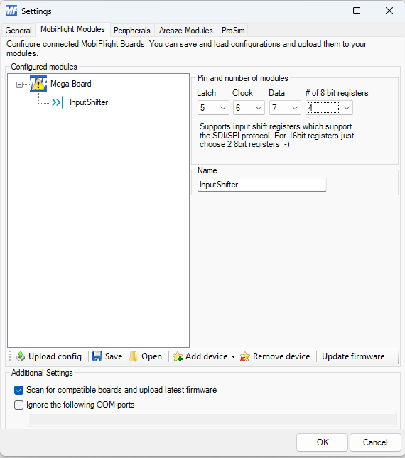
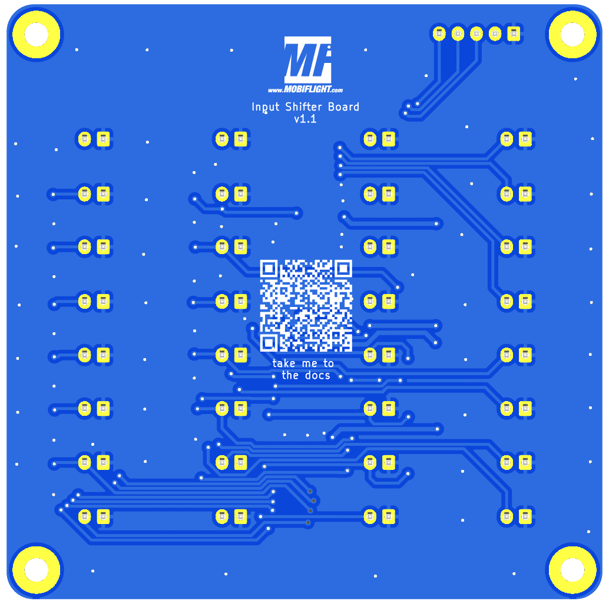
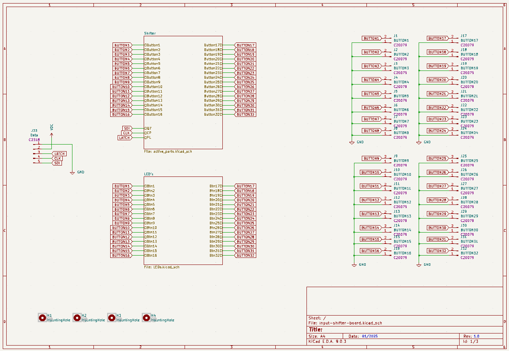
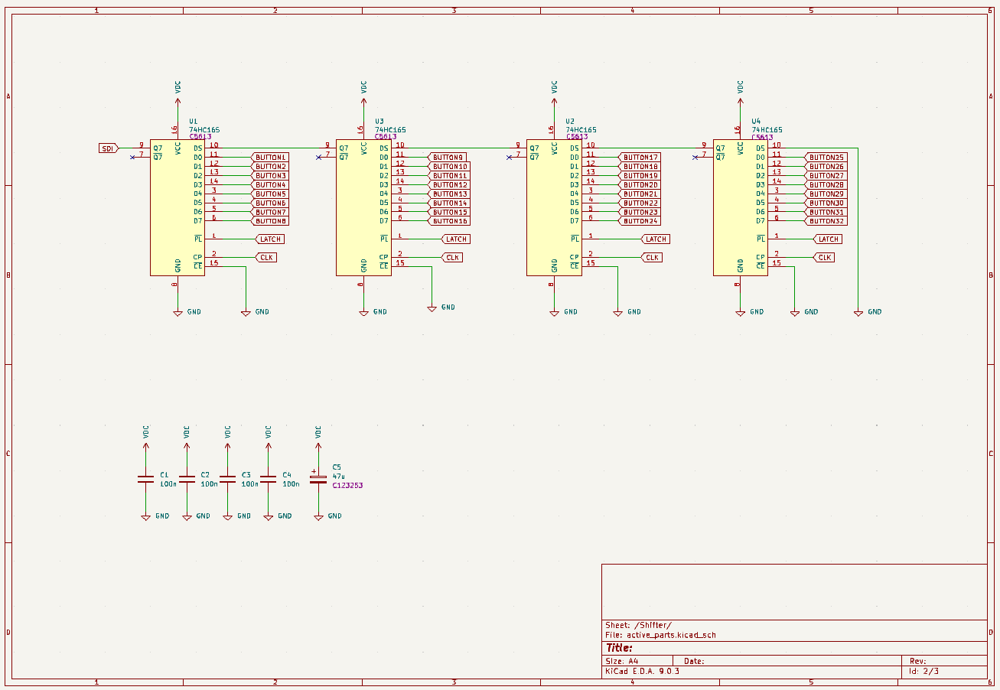
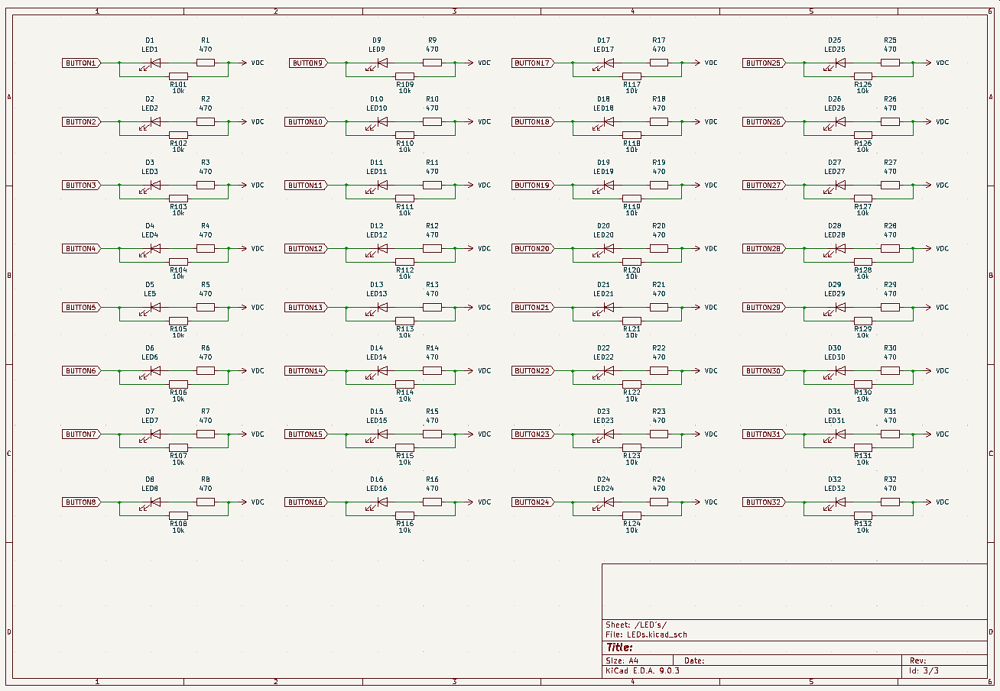

# MobiFlight Input Shifter Board
The MobiFlight Input Shifter Board is a breakout board for easier use of up to 32 buttons. It is designed to work best together with the [MobiFlight Prototyping Board](https://shop.mobiflight.com/product/prototyping-board-v2).

The board uses XH JST connectors for the individual buttons and for connecting to the Prototyping Board. Four 8 bit input shift register are daisy chained. Each input has a LED beside the connector which indicates if the button is pressed.

For more information on how to configure the board with MobiFlight, check out the [MobiFlight Connector documentation](https://docs.mobiflight.com/devices/input-shift-register/).

## Board overview

### Input Shifter IN
Connection coming from your Mobiflight board.

* Pin1 - GND
* Pin2 - VCC
* Pin3 - Latch
* Pin4 - Clock
* Pin5 - Data

### Button 1-32
Connect your button to these connectors.

Polarity does not matter for Buttons.

## Connecting and wiring
The Input Shifter board is designed to work best together with the [MobiFlight Prototyping Board](https://shop.mobiflight.com/product/prototyping-board-v2). Of course, you can also connect it directly to any of the supported microcontrollers.

### MobiFlight Prototyping Board
The prototyping board comes with the required cables to make connection super easy.

* **Connect the 5-pin wire** from the breakout board to the MobiFlight Prototyping Board's 5-pin connector labeled **Shift-Register 2**
* **Upload input shifter board configuration** to the MobiFlight Prototyping Board - [Download multiplexer-config (mfmc)](https://raw.githubusercontent.com/MobiFlight/mobiflight-pcbs/refs/heads/main/led-driver-board/prototyping-board.input-shifter.mfmc)

All inputs on the Input shifter will now work correctly!

### Direct connection
If you are using any of the supported microcontrollers, do the following:

#### Wiring
* Connect the first two pins on the **Data In** connector to **GND**, **5V** and the three remaining pins to free output-capable pins. For an Arduino Mega that could be, eg. D2, D3 D4 and D5. 

#### Board configuration
Add one input shifter device with the three data pins configured as follows and choose four times 8 bit.

Click "Upload config" and your device should work.

## MobiFlight Configuration

> This information will be added soon.

## Case
You can print a case for the board [using this STL file](breakout-multiplexer-case.stl) for better handling and look:

## Additional information

### Bottom side

### Schematic

