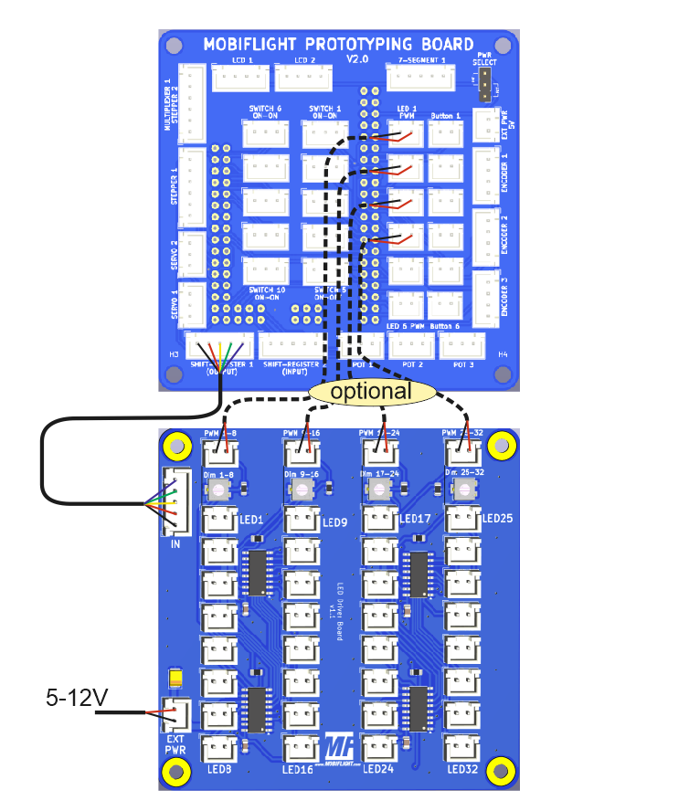
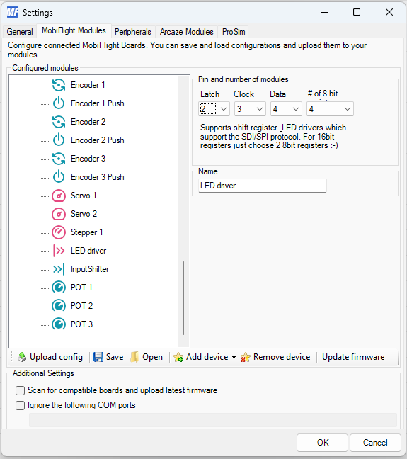

# MobiFlight LED Driver Board
The MobiFlight LED Driver Board is a breakout board for easier use of up to 32 LED's. It is designed to work best together with the [MobiFlight Prototyping Board](https://shop.mobiflight.com/product/prototyping-board-v2).

The board uses XH JST connectors for the individual LED's and for connecting to the Prototyping Board. Four 8 bit output shift register with integrated LED driver are daisy chained. Each group of 8 LED's can be dimmed via PWM input and the max. brightness can be adjusted via a potentiometer.

For more information on how to configure the board with MobiFlight, check out the [MobiFlight Connector documentation](https://docs.mobiflight.com/devices/output-shift-register/).

## Board overview

### LED driver IN
Connection coming from your Mobiflight board.

* Pin1 - GND
* Pin2 - VCC
* Pin3 - Latch
* Pin4 - Clock
* Pin5 - Data In

### Potentiometer Dim 1-8
With this potentiometer the max. intensity of LED's 1-8 can be adjusted.

### Potentiometer Dim 9-16
With this potentiometer the max. intensity of LED's 9-16 can be adjusted.

### Potentiometer Dim 17-24
With this potentiometer the max. intensity of LED's 17-24 can be adjusted.

### Potentiometer Dim 25-32
With this potentiometer the max. intensity of LED's 25-32 can be adjusted.

### PWM 1-8
Connection coming from your Mobiflight board.

* Pin1 - GND
* Pin2 - PWM Signal pin

Without any connection the LED's 1-8 are driven with intensity adjusted with the potentiometer.

### PWM 9-16
Connection coming from your Mobiflight board.

* Pin1 - GND
* Pin2 - PWM Signal pin

Without any connection the LED's 1-8 are driven with intensity adjusted with the potentiometer.

### PWM 17-24
Connection coming from your Mobiflight board.

* Pin1 - GND
* Pin2 - PWM Signal pin

Without any connection the LED's 1-8 are driven with intensity adjusted with the potentiometer.

### PWM 25-32
Connection coming from your Mobiflight board.

* Pin1 - GND
* Pin2 - PWM Signal pin

Without any connection the LED's 1-8 are driven with intensity adjusted with the potentiometer.

### EXT PWR
A power supply **must** be connected. The input voltage can be from 5V up to 12V.
Connect to the Prototyping Board only if the maximal current for all LED's switched ON will not exceed 400mA!

### LED 1-8
First row of connectors for LED's:

* Pin1 - Cathode of LED
* Pin2 - Anode of LED

Polarity **does** matter for LED's.

### LED 9-16
Second row of connectors for LED's:

* Pin1 - Cathode of LED
* Pin2 - Anode of LED

Polarity **does** matter for LED's.

### LED 17-24
Third row of connectors for LED's:

* Pin1 - Cathode of LED
* Pin2 - Anode of LED

Polarity **does** matter for LED's.

### LED 25-32
Fourth row of connectors for LED's:

* Pin1 - Cathode of LED
* Pin2 - Anode of LED

Polarity **does** matter for LED's.

## Connecting and wiring
The LED driver board is designed to work best together with the [MobiFlight Prototyping Board](https://shop.mobiflight.com/product/prototyping-board-v2). Of course, you can also connect it directly to any of the supported microcontrollers.

### MobiFlight Prototyping Board
The prototyping board comes with the required cables to make connection super easy.

* **Connect the 5-pin wire** from the breakout board to the MobiFlight Prototyping Board's 5-pin connector labeled **Shift-Register 1**
* **Connect the 2-pin wires** to the MobiFlight Prototyping Board's 2-pin connectors **LED1**, **LED2**, **LED3** and/or **LED4** if the LED's should be dimmed
* **Upload led driver board configuration** to the MobiFlight Prototyping Board - [Download multiplexer-config (mfmc)](https://raw.githubusercontent.com/MobiFlight/mobiflight-pcbs/refs/heads/main/led-driver-board/prototyping-board.led-driver.mfmc)

All pins on the LED driver will now work correctly!

### Direct connection
If you are using any of the supported microcontrollers, do the following:

#### Wiring
* Connect the first two pins on the **Data In** connector to **GND**, **5V** and the three remaining pins to free output-capable pins. For an Arduino Mega that could be, eg. D2, D3 D4 and D5. 
* Connect four input-capable pins to Data0 to Data3 connectors - first pin is **GND** and is not necessarily required, second pin is PWM pin. You can verify by looking on the backside of the circuit board where the pins are labeled. 

#### Board configuration
Add one output shifter device with the three data pins configured as follows and choose four times 8 bit.

Click "Upload config" and your device should work.

## MobiFlight Configuration

> This information will be added soon.

## Case
You can print a case for the board [using this STL file](breakout-multiplexer-case.stl) for better handling and look:

## Additional information

### Bottom side

### Schematic

