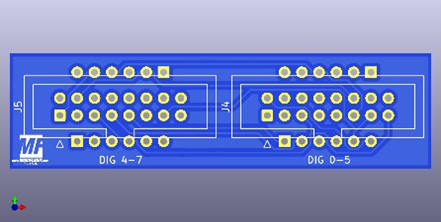
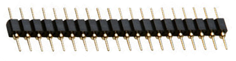
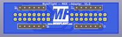
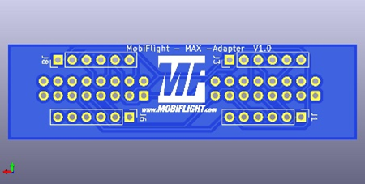
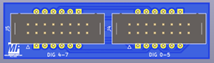

# MobiFlight MAX7219 Adapter Board
The MobiFlight MAX7219 Adapter Board is for those users who have bought the conventional MAX7219 PCBs with the 2x4 digits (e.g., from eBay) and would like to continue using them with this adapter.
The adapter mounts directly to the green original PCBs and uses the MAX7219 chip and provides two sockets that can be used with the MobiFlight MAX7219 PCBs (more information and [pictures also available in the shop](https://shop.mobiflight.com/product/max7219-breakout-adapter)).

## Board overview
 

### DIG 4-7
Connect a 3 or 4 digit PCB to this connector.

### DIG 0-5
Connect a 3 to 6 digit PCB to this connector.

## Assembly instructions

1. Solder socket pin headers - the package comes with 4 x 6 pin headers which you solder to the bottom of the board. These are then plugged into the original green MAX7219 module board.

    

2. Solder the connectors - the package comes with two 2x8 pin connectors which you solder to the top of the board.

## MobiFlight Configuration

> This information will be added soon.

## Additional information

### Top side with components

### Bottom side

### Bottom side with components

### Schematic
