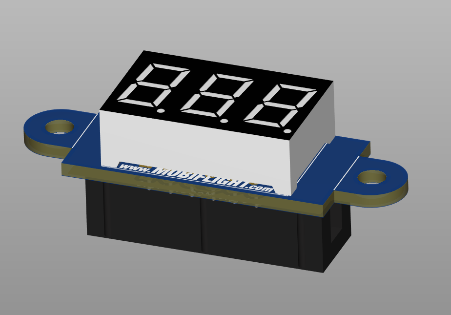
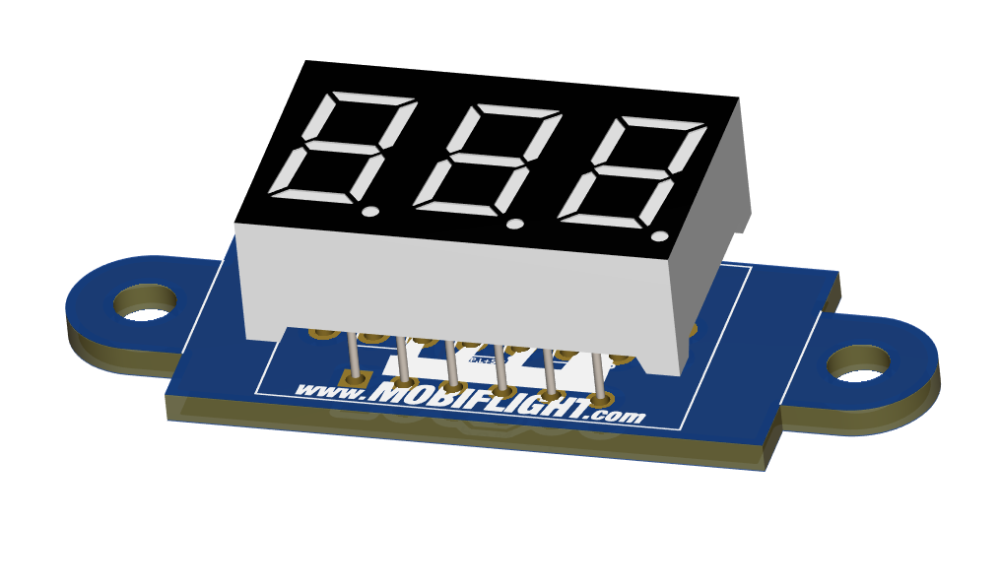
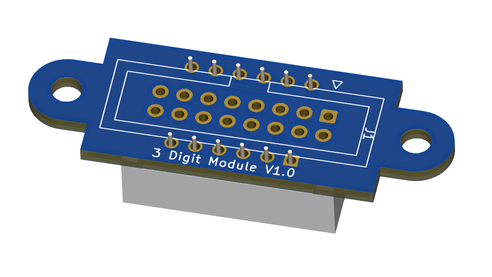
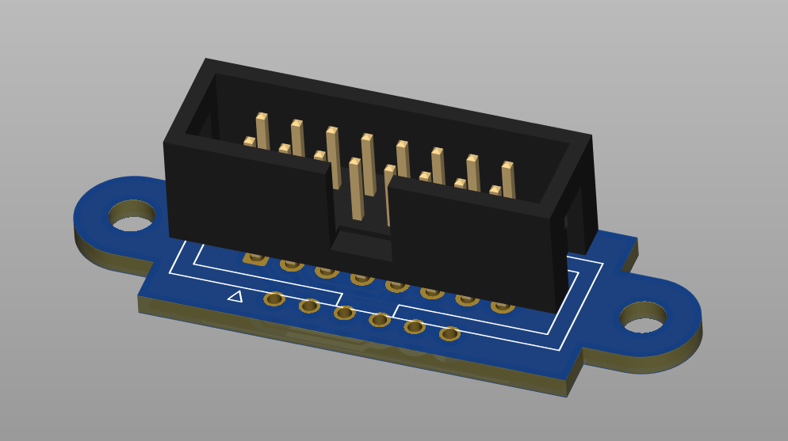
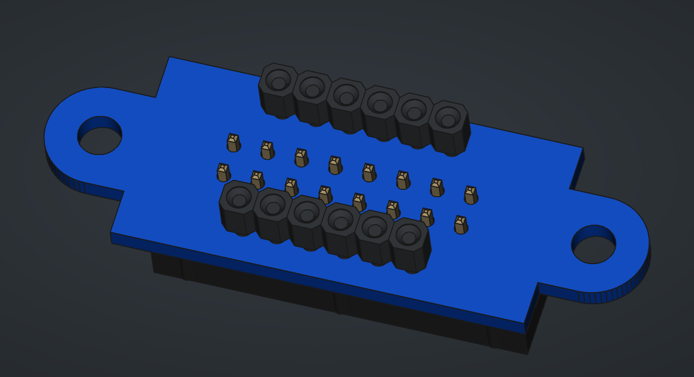

# 7-segment display MAX7217 breakout digits board

These digit holder boards are part of the [MobiFlight MAX7219 Breakout System](https://shop.mobiflight.com/product/max7219-breakout-system) available on the [MobiFlight Shop](https://shop.mobiflight.com). They are not meant to be used alone.

## Skills required
IF you want to assemble the modules yourself, you should have basic understanding of electronics, and reasonable soldering skills. 

This kit includes basic through-hole components with standard 2.54mm pin spacing, so it reasonably easy to assemble , but at minimum you should be able to solder pin connections where the solder flows correctly. 

If you are unsure, for a peace of mind we recommend that you get the modules preassembled and tested.

## Assembly instructions

### Included parts
The kit consists of the printed circuit board (pcb), a flat cable (IDC) connector, a pair of female pin headers, and a common cathode 7 segment display module. The kit has variants for various number of digits on the 7segment, but the contents are otherwise identical. 

The pin headers are optional, you can either use them, and  solder the 7-segment first, remove the display module, and then solder the IDC connector, avoiding soldering next to the connector plastic, or you can also leave them out, it is not a particularly tight fit, and thus also a reasonable choice that results in a bit more compact module.

### Let's get started!

> [!NOTE]  
> Insert the female pin headers to the 7-segment module pins. **If you want to leave the headers out for a more compact module, solder the IDC connector first.** Soldering the 7-segment module directly on the PCB will cover the IDC connector pins and they cannot be soldered after the digit module.

#### Segment module

Place the circuit board upright in front of you, so that the MobiFlight logo is upright.  Insert the 7-segment module on the holes near the board edge. Make sure the decimal points are also oriented correctly. Even though the image below is missing the pin headers, **double check that you installed pin headers to the 7segment module them at this point.**. The image below does *not* feature them, but your module should!

Flip the board over and solder the pin header pins in place.

After you have soldered the headers in, remove the segment module from the headers and proceed to install the flat cable connector.

#### Flat cable connector

The IDC connector goes on the bottom side of the pcb, there is a white silkscreen image of the connector outline that matches the orientation of the cutout in the connector:

Check that the connector is oriented correctly, paying attention to the cutout, and flip the board over.

This image shows how the connector pins are visible between the two pin headers we installed earlier. Again, solder all the pins of the connector in place.

After this you can insert the 7-segment digit module, checking that it is oriented the same way as the MobiFlight logo. 

Your breakout digit module is now assembled.
