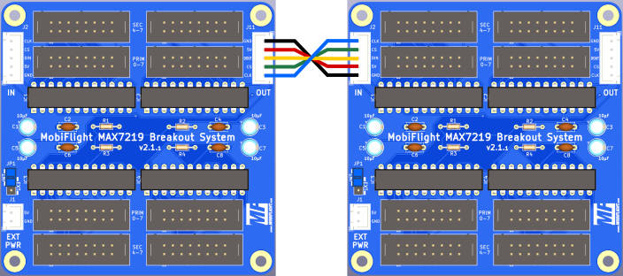

# MobiFlight MAX7219 Breakout System
The MobiFlight MAX7219 Breakout System board is slightly larger than the display PCBs at 80.0 x 66.0 mm.

Since very few can get by with a MAX chip, this PCB is designed in such a way that it can accommodate up to 4 MAX chips. These chips are already connected in a daisy chain on the PCB. So no one has to worry about where the input or output is, just plug in the IN connector from the Arduino and the 4 MAX chips are connected to each other.

Since up to 8 MAX chips can be connected in a single daisy chain, this PCB was designed in such a way that a 2nd PCB can be connected easily and another 4 MAX chips are connected. Two boards connected, and the daisy chain is complete with all 8 MAX chips.

In case of space problems, this 2nd PCB can be mounted in a different location. It couldn't be easier or more comfortable.

It is therefore still possible to control up to 8 digits per MAX chip and as a daisy chain up to 8 x 8 digits, i.e. 64 digits. Since a Mega Module can control up to 4 separate MAX daisy chains, up to 4 x 64, i.e. 256 digits, are possible per Mobiflight board (e.g., [the MEGA Pro Mini](https://shop.mobiflight.com/product/arduino-mega-2560-pro-mini)).

## Connectors
There are two box headers (straight type) assigned to each MAX chip for more flexibility and efficient use.

 

Having two connectors allows for the possibility of dividing the 8 digits of a MAX chip between two groups of digts:
* 2 x 4 digits, 
* 1 x 3 and 1 x 5 digits,
* 1 x 6 digits, and 
* 2 x 3 digits. 

Not all 8 digits of a MAX chip have to be used. Also, the digits do not have to be distributed evenly across the MAX chips.

Between the plugs there are designations such as DIG 0-3, DIG 0-5 and DIG 4-7. This specifies how the digits are to be distributed to the plugs and thus the displays.

 

If, for example, 6 digits are plugged into J2, digits 0-5 are occupied. This means that digits 6 and 7 on connector J3 would remain free because, as is well known, there are no 2-digit displays in our cockpits. The smallest display unit would therefore be 3 digits.

This also applies to connectors J4 and J5, J6 and J7 and J8 and J9.

Displays with 3, 4, 5 and 6 digits can be plugged into the connectors J2, J4, J6 and J8. Displays with 3 or 4 digits can be plugged into connectors J3, J5, J7 and J9, but not more than 8 digits in total. A combination of 5 or 6 digits on J2 and 4 digits on J3 at the same time is therefore not possible.

## Prototyping board

With the 5-pin XH JST cable that is provided, a connection to the prototyping board is simple.

> [!NOTE]
> Starting with v2.0, the pin sequence is the same for both boards, the prototyping board and the MAX7219 breakout board.

## Daisy chain mode

You can connect two boards together and take advantage of the daisy chain capability. Two boards is the maximum, only up to 8 MAX7219 chips can be chained. This is a limitation of the MAX7219 chip itself.

## External Power supply
The power supply with +5V should be provided via a separate power pack, since a MAX chip can consume between 80 and 120 mA of current and thus the Mega Module or a USB interface (maximum 500 mA with USB 2.x or 900 mA with USB 3 .x) can be overloaded.

> [!NOTE]
> When using external power, set the blue jumper to the "EXT" position, otherwise use "INT" position.

## Board overview
 

### MAX7219 - IC1-4
The IC socket and the 4 MAX7219 chips

### Connector - J2-J9
The connectors to connect the flat ribbon cables

### IN-connectors J1+J11
The pins that are connected to pins on the MobiFlight board.

* Pin 1 - VCC
* Pin 2 - GND
* Pin 3 - DIN
* Pin 4 - CS
* PIN 5 - CLK

### OUT-connectors J10+J12
* Pin 1 - VCC
* Pin 2 - GND
* Pin 3 - DOUT
* Pin 4 - CS
* PIN 5 - CLK

## Assembly instructions
1. Solder resistors (10kOhm) to the top of the PCB
1. Solder the capacitors (100nF) to the top of the PCB
1. Solder the Max7219 IC sockets to the top of the PCB
1. Solder the XH JST connectors to the top of the PCB
1. Solder the 8x2 connectors to the top of the PCB
1. Insert the MAX7219 Chips into the sockets, watch out for correct orientation

## MobiFlight Configuration
### Device configuration
See [general documentation for more information](https://github.com/MobiFlight/MobiFlight-Connector/wiki/Input-and-Output-devices#7-segment-modules) on how to configure the 7-segment displays.

### Output config

#### Special feature with 3 digit displays
A special feature is the 3 digit displays. If 2 x 3 digits are used on connectors J2 and J3 in MobiFlight, care must be taken to ensure that they are each offset by one digit. A 3-digit display on J2 would therefore occupy digits 1, 2 and 3 in MobiFlight and on J3 digits 5, 6 and 7 in MobiFlight.

Normally, assignment of the 3 digit displays in MobiFlight when 3 digit displays are used looks like this:

With the breakout board, using two 3-digit displays looks like this:

This also applies if 5 digits are assigned to J2, then only 3 digits can be assigned to J3. But since digit 4 is parallel on J2 and J3, it is imperative to start with digit 5 on J3 for a 3-digit display (digit 5, 6 and 7). Nothing has to be taken into account when wiring, because the 3-digit PCBs already take this into account, regardless of whether they are plugged into J2 or J3.

This may look confusing at first glance, but once you look at the constellation, it quickly becomes clear that this is the only way to ensure optimum utilization without having to plug in jumpers or the like.

## Additional information

### Orientation and pin assignments

The soldering points, which are square, always designate pin 1 of the corresponding component.
After pin 1, the row continues in ascending order with pins 3, 5, 7, 9, 11, 13 and 15. The other row therefore has pins 2, 4, 6, 8, 10, 12, 14 and 16.

With the connectors J2, J4, J6 and J8 the cathodes of the displays are connected in ascending order from pin 2. So pin 2 = cathode of digit 0, pin 4 = cathode of digit 1, pin 6 = cathode 3, pin 8 = cathode 4, pin 10 = cathode 5 and pin 12 = cathode 6. Pins 14 and 16 are on the connectors always free with an even pin number.

The segments were connected to the odd pins. Pin 1 = Segment A, Pin 3 = Segment B, Pin 5 = Segment C, Pin 7 = Segment D, Pin 9 = Segment E, Pin 11 = Segment F, Pin 13 = Segment G and Pin 15 of the DP.

The situation is similar for connectors J3, J5, J7 and J9.
Pin 2 = cathode 4, pin 4 = cathode 5, pin 6 = cathode 6 and pin 8 = cathode 7. Pins 10, 12, 14 and 16 are not used.
In the case of the segments, these are assigned even numbers, as is the case with the plugs.

### Top side with components

### Bottom side

### Schematic
