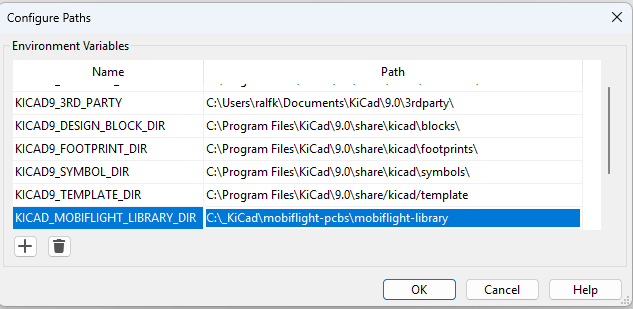
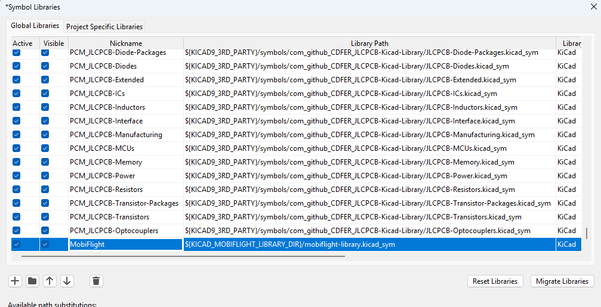
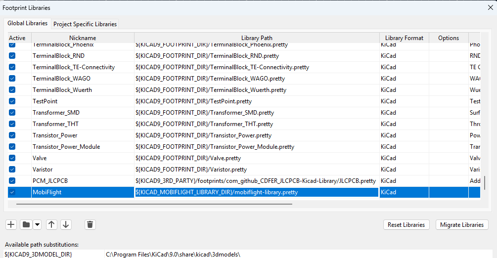

To use this library create a new environment variable "KICAD_MOBIFLIGHT_LIBRARY_DIR" within KiCad and set the path to this folder.

Open the Symbol-Editor and add a Symbol Library, name this library `MobiFlight` and navigate to the path `mobiflight-library.kicad_sym` which is in the folder `mobiflight-pcbs/mobiflight-library`.

Open the Footprint-Editor and add a Footprint Library, name this library `MobiFlight` and navigate to the path `mobiflight-library.pretty` which is in the folder `mobiflight-pcbs/mobiflight-library`.

