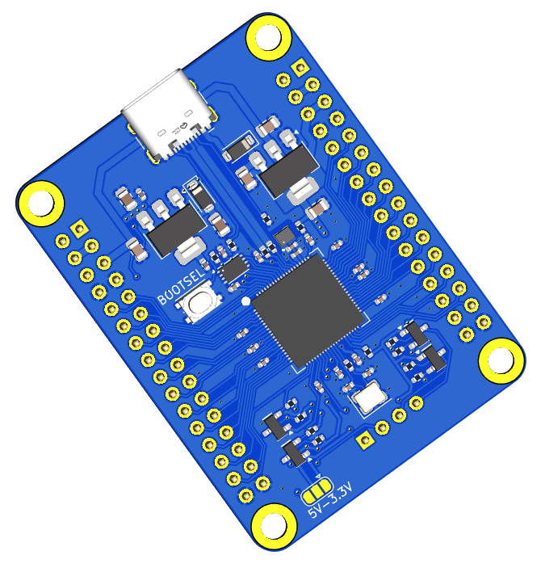
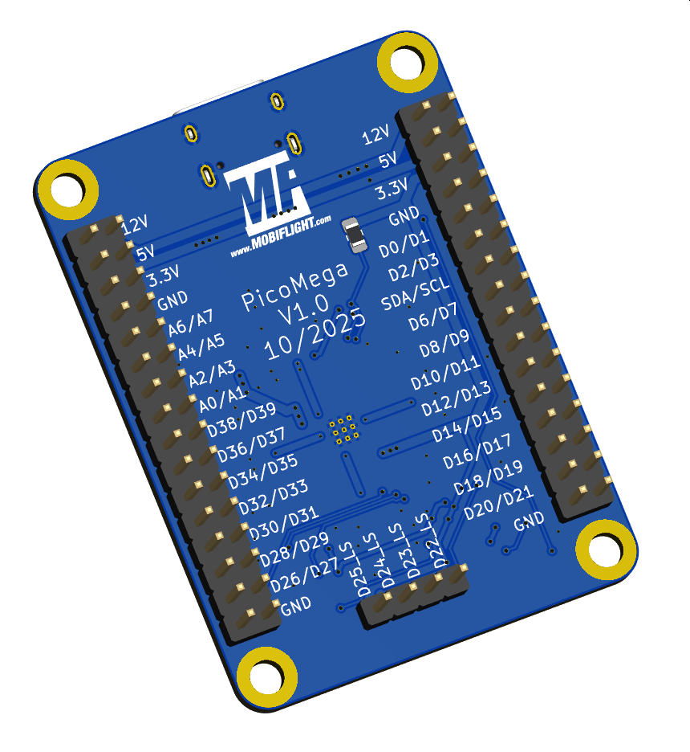
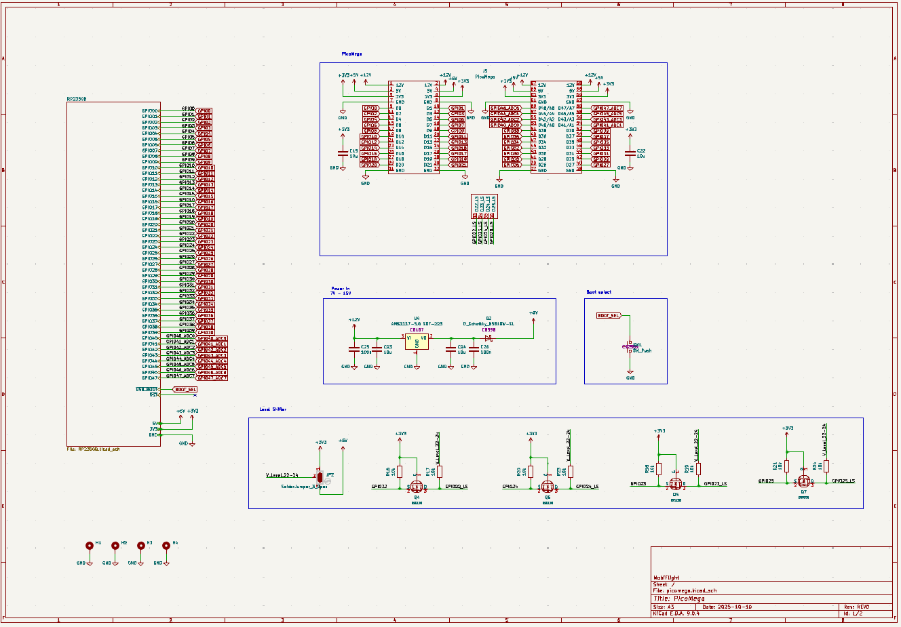
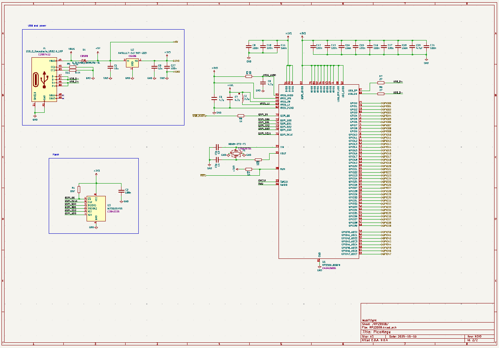

# ✈️ PicoMega - RP2350B Board from Mobiflight

This board brings the power of the **Raspberry Pi RP2350B** to Mobiflight builders.  
You get **much higher performance**, **far more RAM**, modern peripherals (PIO, USB), and still plenty of GPIO for complex cockpit modules. Especially for **community-driven custom devices** that demand higher performance and memory.

---

## 🚀 Why PicoMega for Mobiflight?

### 📈 Performance & Memory Headroom
- **Dual-core Arm Cortex-M33 @ up to 150 MHz**  
- **520 KB on-chip SRAM** for large configs, display buffers (e.g., OLEDs), and complex logic  
These eliminate common out-of-memory and performance limits seen on Mega-based builds.

### 🔌 Modern Peripherals & I/O
- **48 GPIO** and **8 analog inputs** on the PicoMega
- **12 PIO state machines** for precise/parallel I/O timing  
- **2× UART, 2× SPI, 2× I²C**, **24 PWM channels**, **USB 1.1 host & device**, plus **HSTX**  
This enables parallel busses, clean timing for LED drivers, and flexible USB setups.

### ⚡ 5V Ecosystem Friendly (with Notes)
- **GPIO are 5 V-tolerant** (when powered) → safe with many 5 V inputs  
- **Outputs are 3.3 V** → use **pins 22 to 25** with on board level shifter for 5 V-only devices (e.g., MAX7219 logic) and set the soldering jumper accordingly.
This keeps legacy hardware usable while moving to a modern 3.3 V MCU.

### Level Shifters On-Board 
- Pins **22, 23, 24, 25** are connected to **bidirectional BSS138-based level shifters**. Output voltage can be set via soldering jumper to 3.3V or 5V.
- Perfect for driving **5V peripherals** (e.g., MAX7219).  
- ⚠️ Limitation: Level shifters cannot source high current, so **LED's or power-hungry devices** must not be driven directly from these pins. Only inputs from other IC's can be connected. Inputs are working as normal.

---

## ⚠️ Compatibility Notes vs. Arduino Mega 2560

1. **Logic Levels**  
   - Mega: native **5 V** logic.  
   - PicoMega board: **3.3 V logic** with **5 V-tolerant inputs** → use pins with on board level shifters where 5 V logic is required (e.g., MAX7219 DIN/CLK/CS) and set the soldering jumper accordingly.

2. **Analog Inputs**  
   - PicoMega provides **8 analog inputs** (package feature).  
   - Mega offers **16 analog inputs**. If you rely on >8 analogs, plan multiplexing/expanders.
3. **Formfactor**
   - Similar formfactor as the Mega 2560 mini
---

## 📊 PicoMega vs. Arduino Mega 2560 (quick view)

| Feature | **PicoMega** | **Arduino Mega 2560** |
|---|---|---|
| MCU | Dual-core Arm Cortex-M33, up to 150 MHz | ATmega2560, 16 MHz |
| RAM | **520 KB SRAM** | 8 KB SRAM |
| Flash | External QSPI (multi-MB typical) | 256 KB (8 KB used by bootloader) |
| Digital I/O | **48 GPIO** | **54** digital I/O (15 PWM) |
| Analog Inputs | **8** | **16** |
| USB | USB 1.1 **host & device** | USB device (via ATmega16U2) |
| Special I/O | **PIO ×12**, HSTX, 24 PWM | — |
| Logic Level | **3.3 V** (inputs 5 V-tolerant) | **5 V** |
| Best for | Large configs, displays, parallel I/O | Many discrete I/O, 5 V shields |

---

## 🔧 Example Wiring (MAX7219 with External 5 V)

When driving a **MAX7219** from PicoMega:

- Power the MAX7219 with **5 V** (from **Vin/USB 5 V** or external).  
- Use **level shifting** from pins 22 to 25 on **DIN/CLK/CS** (3.3 V → 5 V) and set the soldering jumper to 5V.  
- **GND common** between PicoMega board and MAX7219.

**Wiring Notes**
- **Vin (5 V USB)** → **VCC (5 V MAX7219)**  
- **GND** → **GND**  
- **MOSI (3.3 V)** → (via level shifter e.g. pin 22) → **DIN (5 V)**  
- **SCK (3.3 V)** → (via level shifter e.g. pin 23) → **CLK (5 V)**  
- **CS (3.3 V)** → (via level shifter e.g. pin 24) → **CS/LOAD (5 V)**  
- **Soldering Jumper** mustg be set to 5V.

---

## 🖥 Advantages for Mobiflight Community (Custom) Devices

- **More Flash headroom** (external QSPI) → larger device code & libraries  
- **Much more RAM (520 KB)** → OLED framebuffers, parsing, and caching  
- **Higher CPU headroom** → smooth display updates & complex rules  
- **Dual-Core CPU** → allows splitting tasks (e.g., handling displays and inputs in parallel).  
- **PIO offload** → precise timing for LEDs, drivers, or custom protocols  

Especially valuable for **OLED-heavy** community devices where Mega runs out of RAM/CPU.

---

## ✈️ Why It Matters for Mobiflight
- **Fast response times** → smoother input/output handling with no lag
- **Run bigger configs on fewer boards** → less USB clutter  
- **Stable timing** with PIO & faster cores  
- **Path forward** from 8-bit AVR to modern 32-bit without losing 5 V-world compatibility (with proper level shifting)

---

## 📌 Summary
If you’ve hit the limits of the **Arduino Mega 2560**—RAM, speed, display performance—the **PicoMega board** is your next step:  
✅ Dual-core @ 150 MHz & 520 KB SRAM  
✅ 48 GPIO / 8 analog, USB host/device, PIO  
✅ 3.3 V logic with **5 V-tolerant inputs**  
✅ Perfect for **Mobiflight community devices**
✅ On board level shifter for 4 I/O's

> Upgrade from Mega without sacrificing the 5 V world—just add level shifters where needed.

## Additional information

### Bottom View

### Schematic

