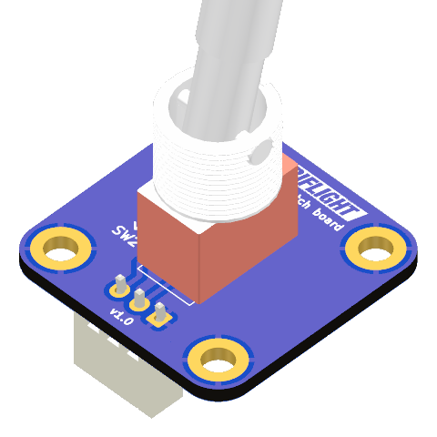

# Toggle Switch Board

The toggle switch board fits the same form factor and 20x20mm mounting hole pattern
as the popular dual encoder board.

This board features a soldering footprint for the [popular metal "small body, large lever"
toggle switch](https://shop.mobiflight.com/product/toggle-switch-12mm-panel-mount/?v=75778bf8fde7),
and can have either a two- or three pin JST XH connector for the wires to fit the
[MobiFlight Prototyping Board](https://shop.mobiflight.com/product/prototyping-board-v2/).

This repository contains the KiCad project files. If you are interested in this board, you can also find it in the
[MobiFlight Community Shop](https://shop.mobiflight.com/product/toggle-switch-bundle).

Ordering from the shop helps us keep MobiFlight free, and helps us make it even better.

Designed by Tuomas Kuosmanen, April 2026.
