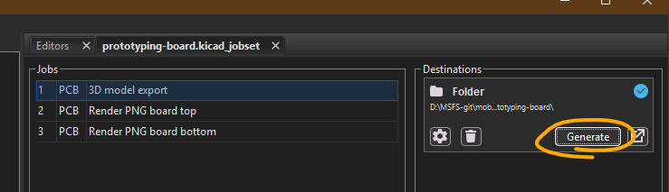

# Jobset files

These files can be used in KiCAD to batch export board images and schema pdf, as well as the STEP 3D model. This file is shared, so in your kicad project, select `File > Open Jobset file...` to load the jobset. Then click the "Generate" button in the jobset panel.

The files will be generated in a folder called `kicad-board-exports`.

There are two jobset files included, they are otherwise identical, but the one 
intended for small boards tilts the board at a somewhat isometric angle, so it hopefully describes the board better.

### Settings for pcb rendering export

Open `KiCAD Preferences > 3D Vieweer > Raytracing renderer` and turn off *Shadows* altogether, they look distracting. Unfortunately the jobset can only render with raytracing mode.
